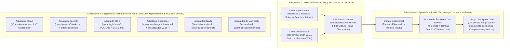

# 🏛️ SDD-Parallel — Arquitectura del Sistema (SSOT)

<p align="center">
  <b>🌐 Idioma / Language:</b>
  <a href="../../../ARCHITECTURE.md">English</a> |
  <a href="../zh-CN/ARCHITECTURE.md">简体中文</a> |
  <b>Español</b> |
  <a href="../pt-BR/ARCHITECTURE.md">Português (BR)</a> |
  <a href="../ja/ARCHITECTURE.md">日本語</a> |
  <a href="../ko/ARCHITECTURE.md">한국어</a> |
  <a href="../ru/ARCHITECTURE.md">Русский</a>
</p>

**Versión:** 0.2.2  
**Estado:** Columna Arquitectónica Aprobada (SSOT)

---

## 1. Visión General de Módulos Arquitectónicos

El sistema `sdd-parallel` está estructurado en tres subsistemas débilmente acoplados, orquestados mediante una representación canónica de grafo de tareas (`src/sdd_parallel/models.py`):


```mermaid
flowchart LR
    subgraph Adapters["Subsistema 1: Adaptadores Polimórficos de Kits SDD (SDDAdapterProtocol & ACL Solo Lectura)"]
        A1["Adaptador BMAD\n(v6 sprint-status.yaml & v7 tickets.toml)"]
        A2["Adaptador Spec Kit\n(.specify/specs/*/tasks.md + extensión oficial)"]
        A3["Adaptador GSD\n(.planning/phases/*-PLAN.md + STATE.md)"]
        A4["Adaptador OpenSpec\n(openspec/changes/*/tasks.md + encabezados v1.16+)"]
        A5["Adaptador Beads\n(.beads/issues.jsonl + sincronización BD dolt)"]
        A6["Adaptador de Manifiesto Personalizado\n(.parallel/custom-kit.yaml)"]
    end

    subgraph Engine["Subsistema 2: Motor DAG Hexagonal y Resolvedor de Conflictos"]
        E1["ASTHotspotScanner\n(Heurística 3 Pasadas: Spine vs Registros Aditivos)"]
        E2["CRGSidecarAdapter\n(code-review-graph v2.3.9 Grafo de Llamadas WAL)"]
        E3["BSPWaveScheduler\n(Empaquetado Voraz First-Fit de Olas, K Pistas, Checkpoints)"]
    end

    subgraph Actuation["Subsistema 3: Aprovisionador de Worktrees y Compuerta de Fusión"]
        W1["prepare / claim-track\n(Ranuras Fijas track-<id> + Reinicio In Situ)"]
        W2["Guarda de Ámbito en Tres Niveles\n(PreToolUse + Terminal Guard + OS chmod a-w)"]
        W3["merge Checkpoint Gate\n(Diff estricto merge-base + Fusión 3 vías polimórfica + Compuertas Agnósticas)"]
    end

    Adapters --> E1 & E2
    E1 & E2 --> E3
    E3 --> W1
    W1 --> W2 --> W3
```

### 1.1. Arquitectura Hexagonal y `SDDAdapterProtocol`

Siguiendo el patrón de Puertos y Adaptadores (Arquitectura Hexagonal), el núcleo de `sdd-parallel` interactúa con todos los marcos de Desarrollo Dirigido por Especificaciones (SDD) exclusivamente a través del contrato fuertemente tipado `SDDAdapterProtocol` (`src/sdd_parallel/adapters/__init__.py`). El núcleo no contiene rutas fijas ni bifurcaciones específicas de kits:

```python
class SDDAdapterProtocol(Protocol):
    """Contrato de extensión polimórfico implementado por todos los marcos SDD soportados."""

    kit_id: str

    def __init__(self, repo_root: Path) -> None: ...

    def detect(self) -> bool:
        """Detecta marcadores de presencia de este marco SDD en el repositorio."""
        ...

    def load_tasks(
        self,
        include_done: bool = False,
        plan_source: str = "auto",
    ) -> list[TaskNode]:
        """Parsea artefactos de hoja de ruta/backlog a modelos canónicos TaskNode."""
        ...

    def reset_tasks_status(
        self,
        task_ids: Sequence[str],
        target_status: str = "ready-for-dev",
    ) -> None:
        """Revierte polimórficamente los estados de tareas tras un rollback transaccional LIFO de ola."""
        ...

    def cleanup_wave_artifacts(
        self,
        wave_id: int,
        task_ids: Sequence[str],
    ) -> None:
        """Limpia especificaciones y artefactos temporales generados para una ola."""
        ...

    def check_wave_zero_blockers(self, wave: Wave | None = None) -> list[str]:
        """Verifica prerequisitos específicos del marco (Git limpio, contextos compilados, listas de verificación)."""
        ...

    def check_preflight_context_gate(self, wave: Wave) -> list[str]:
        """Verifica archivos de contexto de épica/funcionalidad precompilados antes de lanzar pistas paralelas."""
        ...

    def get_allowed_write_globs(self, track: WaveTrack) -> list[str]:
        """Retorna patrones glob de metadatos del marco permitidos para modificación en el worktree."""
        ...

    def get_forbidden_files(self, wave: Wave, track: WaveTrack) -> dict[str, str]:
        """Mapea contratos protegidos y especificaciones inmutables específicos del marco."""
        ...

    def get_track_env_vars(self, track: WaveTrack) -> dict[str, str]:
        """Retorna variables de entorno específicas del kit inyectadas en la ejecución de la pista."""
        ...

    def prepare_worktree_overlay(self, worktree_path: Path, track: WaveTrack) -> list[str]:
        """Inyecta archivos overlay específicos del kit en el worktree y retorna entradas para git exclude."""
        ...

    def verify_track_spec_scope(
        self,
        worktree_path: Path,
        track: WaveTrack,
        forbidden_files: dict[str, str],
    ) -> list[str]:
        """Verifica restricciones de alcance a nivel de especificación dentro del worktree antes de la fusión."""
        ...

    def render_worker_command(self, track: WaveTrack) -> str:
        """Genera el comando nativo de CLI para la guía de ejecución del operador y modos Autopilot."""
        ...

    def default_artifacts_dir(self) -> Path:
        """Retorna el directorio de salida por defecto para planes de ola e informes generados."""
        ...

    def get_status_files(self) -> list[str]:
        """Retorna rutas relativas a archivos de estado del marco conciliados mediante fusión 3-way."""
        ...

    def get_change_worktree(self, change_id: str) -> Path | None:
        """Retorna la ruta de worktree existente asignada por el marco para change_id, si existe."""
        ...

    def update_state_on_merge(
        self,
        wave_number: int,
        merged_task_ids: Sequence[str],
    ) -> Path | None:
        """Sincroniza el estado/BD del marco tras el punto de control de fusión de barrera de la Ola K."""
        ...
```

### 1.2. Matriz de Responsabilidades: Motor Agnóstico vs Adaptadores Polimórficos

| Fase / Aspecto | Subsistema Responsable | Rol Arquitectónico y Mecanismos |
| :--- | :---: | :--- |
| **Parseo de Artefactos y Conversión a Tareas** | `SDDAdapter` | Interpreta formatos específicos (YAML, Markdown, JSONL). Convierte tareas a `TaskNode` canónicos (`write_files`, `read_files`, `depends_on`). |
| **Validación Previa de Bloqueos** | `SDDAdapter` | Verifica compuertas de preparación (`check_wave_zero_blockers`): Git limpio, contextos BMAD, listas de Spec Kit. |
| **Clasificación AST de Archivos** | `Core Engine` | Analizador estático de 3 pasadas (`ASTHotspotScanner`) que categoriza módulos en `SPINE`, `ADDITIVE_REGISTRY` y `STANDARD`. |
| **Radio de Impacto Semántico** | `Core Engine` | Calcula el radio de colisión ponderado ($W_A \cap I_B$) mediante `CRGSidecarAdapter` (`code-review-graph v2.3.9` WAL). |
| **Partición en Olas (Planificador BSP)** | `Core Engine` | Planificador determinista voraz `First-Fit` `BSPWaveScheduler` (1 tarea por pista en orden de entrada) que garantiza 100% de cobertura de historias y aciclicidad formal (Kahn). |
| **Aprovisionamiento de Ranuras de Worktrees** | `Core Engine` + `Adapter` | Asigna ranuras fijas `track-<id>` y permisos del SO (`chmod a-w`). El adaptador aporta `allowed_write_globs` y `forbidden_files`. |
| **Instrucciones de Ejecución de Agentes** | `SDDAdapter` | Genera comandos nativos (`/speckit.implement`, `/gsd-execute-phase`, `/opsx:apply`, `bd update`, `/bmad-build`). |
| **Guarda de Ámbito Multinivel** | `Core Engine` | Intercepta llamadas `PreToolUse`, comandos de terminal (`Bash`, `run_command`) y aplica bloqueos de solo lectura del SO. |
| **Fusión Monótona de Estados en 3 Vías** | `SDDAdapter` + `Core` | El motor coordina la fusión Git; el reconciliador semirreticular (`status_merger.py`) fusiona estados sin marcadores de conflicto. |
| **Co-Consistencia de Estado y BD Post-Merge** | `SDDAdapter` + `Core` | El hook polimórfico `update_state_on_merge()` asegura que los motores embebidos (p. ej., Dolt DB de Beads vía `bd import --allow-stale`) y los registros monolíticos (`.planning/STATE.md`) se sincronicen inmediatamente tras la fusión 3-way. |
| **Rollback Transaccional LIFO** | `Core Engine` + `Adapter` | Crea ramas de seguridad (`backup/wave-<K>-before-rollback-*`) y resetea `HEAD`; el adaptador restablece estados. |

### 1.3. Coexistencia de Múltiples Kits y Aislamiento en Sandboxing

En repositorios empresariales con múltiples marcos coexistentes:
1. **Preferencia Explícita:** La opción CLI `--kit <nombre>` o la clave `"default_kit"` en la configuración tiene prioridad absoluta.
2. **Heurística de Tareas Activas (`kit="auto"`):** Activa automáticamente el primer marco que contenga tareas sin completar (`len(active_tasks) > 0`).
3. **Telemetría de Diagnóstico:** `diagnose_multi_kit_coexistence()` alerta al operador sin interrumpir la ejecución.
4. **Sandboxing entre Marcos:** Al generar `.parallel-lock.json`, los directorios de los marcos **inactivos** se bloquean bajo `forbidden_files` con el motivo `"Locked by inactive SDD framework sandboxing"`.

---

## 2. Modelo Matemático de Conflictos y Taxonomía de Archivos

Para cada tarea pendiente $T_i$, el motor evalúa:
- $W(T_i)$ — Conjunto de archivos que la tarea **modifica o crea** (`write_files`).
- $R(T_i)$ — Conjunto de archivos que la tarea **lee o importa** como prerrequisitos (`read_files`).
- $I(T_i)$ — **Radio de Impacto Ponderado** alrededor de $W(T_i)$, calculado vía `CRGSidecarAdapter` (`code-review-graph v2.3.9`, método `get_impact_radius_sql` con `resolution="direct"`, `min_impact_score=0.5`, atenuación $\gamma = 0.7$ a lo largo de aristas `CALLS=1.0`, `INHERITS/IMPLEMENTS/OVERRIDES=0.9`, `TESTED_BY=0.8`, `IMPORTS_FROM=0.7`).

### 2.1. Tres Clases de Archivos en el Código

1. **Archivos de Columna Troncal (`FileRole.SPINE`):**
   - Definiciones de esquemas, representaciones intermedias globales y cadenas secuenciales de migración de bases de datos (p. ej., módulos con `SCHEMA_VERSION`, `auto_migrate` o modelos raíz `schema.py`/`models.py`).
   - **Regla:** Tareas que modifican el mismo archivo `SPINE` **nunca se planifican en la misma ola** y se serializan en una cadena de dependencias estricta.
2. **Registros Aditivos Compartidos (`FileRole.ADDITIVE_REGISTRY`):**
   - Puntos de entrada de alto nivel donde las funcionalidades registran comandos o endpoints independientes (`cli.py` con `@app.command`, `mcp/server.py` con `@mcp.tool`, `__init__.py` con `__all__`).
   - *Invariante Arquitectónico (ADR-0002):* Las utilidades de formateo compartidas (`console.py`, `markdown.py`, `egress/`) quedan estrictamente excluidas de los registros aditivos y se clasifican como `FileRole.STANDARD`.
   - **Regla:** Las tareas que intersecan *únicamente* en archivos `ADDITIVE_REGISTRY` genuinos **pueden ejecutarse concurrentemente** en ranuras `git worktree` separadas con guía de solo inserción (append-only) inyectada en `.tmp/track-context.md`. La fusión semántica sin conflictos está garantizada para los rastreadores de estado SDD (`status_merger.py`). Los registros aditivos en Python (`cli.py`, `__init__.py`, `*/mcp/server.py`) se fusionan mediante el fusionador determinista 3-way sobre el AST de la biblioteca estándar (`registry_merger.py`: importaciones de cabecera disjuntas, `__all__` y funciones/comandos de nivel superior ortogonales), con respaldo fail-closed (`None` $\to$ `Partial Barrier Merge`) si se mutan cuerpos de funciones existentes o símbolos en colisión.
3. **Módulos Estándar (`FileRole.STANDARD`):**
   - Módulos estándar de lógica de negocio, adaptadores y presentadores de salida.
   - **Regla:** Cualquier intersección $W(A) \cap W(B) \neq \emptyset$ bloquea la ejecución concurrente en la misma ola, salvo que las especificaciones declaren notas distintas de funciones aisladas en `shared_function_notes` y `ASTHotspotScanner.are_functions_isolated()` confirme que ambas funciones existen y no tienen ninguna arista de llamada directa o transitiva intra-archivo (`_has_isolated_function_scope`). Los archivos `STANDARD` nunca están exentos del cálculo del radio de impacto.

### 2.2. Flujo de Análisis Estático AST en 3 Pasadas (`ASTHotspotScanner`)

En cumplimiento del **Invariante 7 (Arquitectura Anti-Sobreajuste e Invariant-First)**, los roles de archivo se determinan dinámicamente sin nombres de proyecto codificados:
1. **Pasada 1 (Análisis de Firmas):** Escaneo de palabras clave de migración (`_SPINE_KEYWORDS = ("SCHEMA_VERSION", "auto_migrate", "_migrate_v")`) $\to$ `has_schema_version`.
2. **Pasada 2 (Grafo de Importaciones e Inspección de Decoradores):** Recorrido de nodos `Import`/`ImportFrom` para calcular la centralidad de entrada (Fan-In `len(meta.imported_by)`) e inspección de `decorator_list` buscando patrones de registro mediante pistas de receptor acotadas por token (`_ROUTER_RECEIVER_HINTS` en `@app.command`, `@router.get`, `@mcp.tool`, etc.; los decoradores sin receptor `@get`/`@register`/`@command` y los receptores que no son enrutadores como `@cache_client.get` permanecen en `FileRole.STANDARD`).
3. **Pasada 3 (Clasificación Determinista `SPINE > ADDITIVE_REGISTRY > STANDARD`):**
   - Pruebas (`tests/`, `test_*.py`) $\to$ siempre `STANDARD`.
   - `SPINE`: si `has_schema_version == True` $\lor$ nombre de archivo en `{"models.py", "schema.py"}` $\lor$ **Centralidad Topológica $\text{In-Degree} \ge 5$**.
   - **Spine Buckets (Clase C):** `DEFAULT_SPINE_BUCKET_GLOBS` (`**/migrations/**`, `**/versions/**`, `docs/adr/**`) mapeados mediante `extract_spine_bucket()` serializan tareas concurrentes que crean nombres de archivo distintos dentro del mismo directorio ordenado.
   - `ADDITIVE_REGISTRY`: si `has_registry_decorators == True` $\lor$ punto de entrada en `{"cli.py", "__init__.py"}` $\lor$ `*/mcp/server.py`.
   - `STANDARD`: todos los módulos de lógica de negocio restantes.
   - **Extracción de Tokens de Espacio de Nombres (Clase D):** `extract_namespace_tokens()` extrae flags CLI normalizados (`cli:--flag`), variables de entorno (`env:VAR`) y rutas HTTP (`route:METHOD /path`) de las descripciones de tareas (filtrando secciones de solo lectura y cláusulas negadas) para detectar colisiones de registro entre archivos distintos.
   - **Límite Políglota:** El análisis AST integrado sin dependencias (`ast_scanner.py`, `registry_merger.py`) apunta nativamente a Python; para repositorios en JS/TS, Go, Rust y Java, la planificación y la seguridad en barrera se apoyan en `code-review-graph` (Tree-sitter), `DEFAULT_CONTRACT_GLOBS`, `DEPENDENCY_DRIFT` y `Partial Barrier Merge`.

### 2.3. Tipos de Aristas en el Grafo de Conflictos (`ConflictEdge`)

1. **`EXPLICIT_DEP` (Arista Dirigida $A \to B$):** Dependencia explícita declarada en la hoja de ruta o requisito de flujo de datos. La tarea $B$ se ejecuta en la ola $\text{wave}(B) > \text{wave}(A)$.
2. **`SPINE_ORDER` (Arista Dirigida $A \to B$):** Cadena secuencial que modifica un archivo `SPINE` o comparte un `Spine Bucket` (`extract_spine_bucket()`, Clase C — p. ej., migraciones de base de datos `005_a.sql` vs `005_b.sql`).
3. **`DIRECT_COLLISION` (Arista de Conflicto No Dirigida $A \leftrightarrow B$):** $W(A) \cap W(B) \setminus \text{AdditiveRegistries} \neq \emptyset$. Las tareas $A$ y $B$ no pueden ejecutarse en la misma ola ($\text{wave}(A) \neq \text{wave}(B)$).
4. **`SEMANTIC_COLLISION` (Arista de Conflicto de Tipo 2 $A \leftrightarrow B$):** $(W(A) \cap I(B)) \cup (W(B) \cap I(A)) \neq \emptyset$. La tarea $A$ modifica una interfaz que la tarea $B$ invoca directamente.
5. **`NAMESPACE_COLLISION` (Arista de Conflicto No Dirigida $A \leftrightarrow B$, Clase D):** `namespace_tokens` solapados (flags CLI, variables ENV o rutas HTTP compartidas entre archivos distintos).

---

## 3. Contratos Clave de Artefactos en Tiempo de Ejecución

### 3.1. Contrato de Contexto de Worktree (`.tmp/track-context.md`)

Inyectado por `sdd-parallel prepare --wave K` en el prompt del agente:

```markdown
# PARALLEL TRACK CONTEXT BOUNDARY (ENFORCED)
- **Wave:** 1 | **Track:** track-a | **Assigned Stories:** 11-2
- **Recommended Model Effort:** high

## 1. Allowed Exclusive Write Scope
- `src/canonical/intervals.py`
- `tests/test_intervals.py`

## 2. Shared Additive Registries (Isolated Append Scope)
- `src/canonical/normalizer.py` (Scope: function `_classify_reads` only)

## 3. Forbidden Files (Locked by Sibling Tracks in Wave 1)
- `src/canonical/manifest.py` (Locked by track-b)
- `src/storage/schema.py` (Spine Lock Chain)
```

### 3.2. Manifiesto de Bloqueo de Ámbito (`.parallel-lock.json`)

Leído por los ganchos `PreToolUse` para evaluación instantánea:

```json
{
  "wave_id": 1,
  "track_id": "track-a",
  "stories": ["11-2"],
  "repo_root": "/workspace/project",
  "worktree_root": "/workspace/project/.worktrees/track-a",
  "allowed_write_globs": [
    "src/canonical/intervals.py",
    "src/canonical/normalizer.py",
    "tests/**",
    ".tmp/**"
  ],
  "additive_shared_files": [
    "src/canonical/normalizer.py"
  ],
  "forbidden_files": {
    "src/canonical/manifest.py": "Locked by track-b (story 11-3)",
    "src/storage/schema.py": "Locked by Spine Chain"
  }
}
```

---

## 4. Mecanismos Técnicos No Invasivos y Soporte de 5 Kits

### 4.1. Inyección de Entorno Sin Contaminación del Worktree

Garantiza que el agente inicie con `git status --porcelain == ""` en los 5 marcos:
1. Contexto de orquestación en `.tmp/track-context.md` (`.tmp/` en `.gitignore`).
2. Manifiesto de bloqueo en `.parallel-lock.json` (`.parallel-lock.json` en `.gitignore`).
3. Reglas de exclusión local en `.git/worktrees/<name>/info/exclude`.
4. Variables de entorno (como `SPECIFY_FEATURE`) inyectadas dinámicamente en el proceso.

### 4.2. Validación Previa y Protección de Especificaciones Inmutables

Auditoría y protección estricta (`FORBIDDEN_STATE_FILES`):
- **GitHub Spec Kit:** Protege `.specify/memory/constitution.md`, `.specify/feature.json`, `spec.md`, `plan.md`.
- **GSD:** Protege `.planning/STATE.md`, `ROADMAP.md`, `PROJECT.md`.
- **OpenSpec:** Protege `openspec/project.md`, `openspec/specs/**`, `openspec/config.yaml`.
- **Beads:** Protege `.beads/config.yaml` y `.beads/metadata.json`.
- **BMAD:** Valida y protege `epic-<N>-context.md`.

### 4.3. Cálculo de Radio de Explosión vía `CRGSidecarAdapter`

1. **Anclaje al Repositorio Principal:** Inicialización con `main_repo_root` evitando errores de ruta relativa.
2. **Compatibilidad con Modo WAL:** Consultas concurrentes seguras sobre SQLite.
3. **Supresión de Ruido:** Filtro `min_impact_score=0.5`.

### 4.4. Fusión Monótona Polimórfica de Estados en 3 Vías

1. **BMAD (`sprint-status.yaml`):** Semirretícula: $\texttt{backlog} (0) < \texttt{ready-for-dev} (1) < \texttt{in-progress} (2) < \texttt{review} (3) < \texttt{done} (4)$, preservando comentarios y formato YAML.
2. **GitHub Spec Kit y OpenSpec (`tasks.md` Markdown):** Conciliación automática de líneas `- [ ]` a `- [x]` con 0 marcadores de conflicto.
3. **Beads (`.beads/issues.jsonl`):** Fusión JSONL monótona por ID (`open < in-progress < closed`).
4. **Protección UTF-8 BOM (`utf-8-sig`):** Neutralización de marcas BOM de PowerShell (`\ufeff`).

### 4.5. Ranuras Fijas (`track-<id>`) y Reinicio In Situ ($O(1)$ Espacio)

Mantiene un grupo permanente de $K = \text{max\_tracks}$ ranuras (`track-a`, `track-b`):
- Evita creación y borrado masivo de carpetas que rompen el árbol del IDE.
- Reinicio atómico in situ: `git checkout -B parallel/<track_id> master ; git clean -fd`.

### 4.6. Guarda de Ámbito en Tres Niveles

1. **Nivel 1 (Gancho PreToolUse):** Intercepta herramientas de mutación de archivos (`write_file`, `edit_file`).
2. **Nivel 2 (Terminal Guard):** Intercepta comandos de shell (`Bash`, `run_command`, `cmd`, `powershell`) bloqueando redirecciones (`>`) o editores en línea (`sed -i`).
3. **Nivel 3 (Bloqueos de Solo Lectura del SO):** Aplica `chmod a-w` y `git config core.fileMode false` impidiendo físicamente la escritura.
4. **Compuerta de Verificación (`verify_wave`):** Inspección de diffs `git diff $(git merge-base master HEAD)...HEAD` previa a la integración.

### 4.7. Motor de Rollback Transaccional LIFO

- **`abort-wave --wave K`:** Con el valor por defecto `fixed_slots=True`, reinicia las ranuras (`parallel/track-*`) in situ al `HEAD` del repositorio e informa las ramas restablecidas; con `--dynamic-worktrees`, elimina directorios efímeros y borra las ramas `parallel/wave-*`. Limpia el archivo obsoleto `.parallel/wave-plan.json`.
- **`rollback-wave --wave K [--save-backup]`:** Revierte en estricto orden LIFO, crea rama de respaldo `backup/wave-<K>-before-rollback-*` y restablece estados polimórficamente.

### 4.8. Compuertas de Calidad Agnósticas y Auto-Rollback Transaccional

- **Resolvedor Universal de Compuertas (`resolve_checkpoint_gates`):**
  1. *Prioridad 1:* `.parallel-config.json` (`checkpoint_gates: [...]`).
  2. *Prioridad 2:* `pyproject.toml` (`[tool.sdd-parallel].checkpoint_gates`).
  3. *Prioridad 3:* Autodetección de stack (Python `pytest/ruff/mypy`, Node/TS `npm test`, Rust `cargo test`, Go `go test ./...`).
- **Resiliencia ante Suites Vacías (`_is_no_tests_collected`):** El código 5 en pytest (`NO_TESTS_COLLECTED`) o `"no test files found"` no hace fallar la fusión salvo que esté habilitado `--strict-gates`.
- **Compuerta AST Pre-Merge (`ast_diff_gate.py`):** Ejecutada dentro de `WorktreeManager.verify_wave()` sobre `>= 2` ranuras de worktree aisladas antes de `git merge`. Detecta ciclos de importación virtuales entre tracks (Tarjan SCC, Clase G), deriva de firmas/valores por defecto/constantes frente a `merge-base` (Clases A/B), funciones auxiliares nuevas estructuralmente duplicadas mediante shingles de AST normalizado (Jaccard $\ge 0.75$, Clase F) y ediciones concurrentes de manifiestos/lockfiles de dependencias (Clase H). Pasar `--defer-ast-violations` registra retroalimentación NACK (`_record_track_barrier_nack()`), conserva una rama de seguridad `backup/` y difiere los tracks infractores sin reinicio manual.
- **Partial Barrier Merge (Por Defecto) y Rollback Atómico Estricto (`--no-partial-merge`):** El comando CLI `sdd-parallel merge --wave K` usa por defecto `partial_merge=True` (ordenado por señales de centralidad estructural OCC): los tracks sanos aterrizan incrementalmente sobre una `master` limpia, mientras que los tracks en conflicto o que fallan compuertas se aíslan mediante bisección determinista de culpables (`_isolate_culprit_tracks_by_bisection`), se preservan en `backup/wave-<K>-<track>-failed-<ts>`, se registran en `.parallel/barrier-feedback-<story_id>.json` y se replanifican vía `BSPWaveScheduler.reschedule_remaining_waves()`. Pasar `--no-partial-merge` exige rollback transaccional estricto todo-o-nada (`git merge --abort` + `git reset --hard pre_merge_head`).

### 4.9. Comando de Demostración Offline (`sdd-parallel demo`)

El comando autónomo `sdd-parallel demo [--kit {bmad,spec-kit,gsd,openspec,beads,all}] [--keep-temp]` genera un repositorio efímero y verifica la planificación principal, el aislamiento, la fusión de registros AST en 3 vías y las compuertas de checkpoint en vivo sin conexión, sin claves API ni acceso a la red (`< 5s` por kit con compuerta smoke en vivo `run_quality_gates=True`).

### 4.10. Referencia Completa de Comandos CLI

| Comando | Propósito | Opciones Principales |
| :--- | :--- | :--- |
| `plan` | Calcula el DAG de conflictos y planifica olas paralelas | `--repo <path>`, `--max-tracks <K>`, `--kit <auto\|kit>`, `--plan-source <auto\|plan\|specs>`, `--include-done`, `--dry-run`, `--routing-file <path>` |
| `prepare` | Aprovisiona ranuras fijas de pistas y bloqueos para la Ola K | `--repo <path>`, `--wave <K>`, `--max-tracks <K>`, `--kit <auto\|kit>`, `--antigravity-layout`, `--dynamic-worktrees`, `--headless`, `--dry-run`, `--routing-file <path>` |
| `claim-track` | Asocia bloqueos de límites a un worktree externo existente | `--repo <path>`, `--wave <K>`, `--track <id>`, `--worktree <path>`, `--max-tracks <K>`, `--kit <auto\|kit>`, `--headless` |
| `run-guide` | Muestra la matriz de instrucciones para el operador de la Ola K | `--repo <path>`, `--wave <K>`, `--max-tracks <K>`, `--kit <auto\|kit>`, `--antigravity-layout`, `--routing-file <path>` |
| `verify-wave` | Audita diffs de worktrees, cumplimiento de bloqueos, gestiona escalados de alcance y registra el manifiesto de barrera | `--repo <path>`, `--wave <K>`, `--max-tracks <K>`, `--kit <auto\|kit>`, `--defer-ast-violations`, `--dynamic-worktrees` |
| `merge` | Fusión de barrera con merge 3-way AST/estados, compuertas, fusión parcial / rollback y manifiesto | `--repo <path>`, `--wave <K>`, `--max-tracks <K>`, `--kit <auto\|kit>`, `--strict-gates`, `--skip-gates`, `--partial-merge` / `--no-partial-merge`, `--cleanup`, `--dry-run`, `--dynamic-worktrees` |
| `merge-status` | Fusión determinista autónoma de 3 vías para sprint-status.yaml | `--base <file>`, `--ours <file>`, `--theirs <file>`, `--out <file>` |
| `check-lock` | Valida permisos de modificación de un archivo mediante lógica de hook | `--file <path>`, `--tool <name>` (salida JSON formateada con `indent=2`) |
| `install-plugin` | Empaqueta e instala el plugin portable para Antigravity | `--target-dir <path>` (por defecto `~/.gemini/config/plugins/sdd-parallel`) |
| `init-custom` | Asistente interactivo para generar `.parallel/custom-kit.yaml` | `--repo <path>`, `--specs-dir <dir>`, `--format <markdown\|yaml>`, `--test-cmd <cmd>`, `--non-interactive`, `--dry-run` |
| `autopilot` | Genera o ejecuta comandos en modo Autopilot Multiconversación | `--repo <path>`, `--wave <K>`, `--max-tracks <K>`, `--kit <auto\|kit>`, `--harness <antigravity\|claude-code\|codex>`, `--antigravity-layout`, `--execute`, `--routing-file <path>` |
| `abort-wave` | Aborta la ola antes del merge; reinicia ranuras fijas a `HEAD` (o elimina ramas dinámicas) | `--repo <path>`, `--wave <K>`, `--dynamic-worktrees` |
| `rollback-wave` | Rollback atómico LIFO de ola integrada con rama de respaldo | `--repo <path>`, `--wave <K>`, `--to-commit <hash>`, `--save-backup` / `--no-backup`, `--kit <auto\|kit>`, `--dynamic-worktrees` |
| `demo` | Ejecuta demostración offline autónoma de Merge-Bomb (`~6–9s` por kit) o crea sandbox | `--kit <bmad\|spec-kit\|gsd\|openspec\|beads\|all>`, `--keep-temp`, `--scaffold-only`, `--output-dir <path>` |
| `bench` | Ejecuta backtest retrospectivo evaluado frente al modelo estático de conflictos `TaskNode` sobre historial Git o demo | `--repo <path>`, `--since <rev>`, `--until <rev>`, `--demo`, `--max-tracks <K>`, `--kit <auto\|kit>`, `--format <text\|json>` |
| `inspect` | Genera y visualiza el HTML Wave Inspector offline autónomo | `--repo <path>`, `--plan <path>`, `--output <path>`, `--open`, `--kit <auto\|kit>` |

### 4.11. Límites Modulares de Dark Software Factory, Manifiesto de Ejecución y Enrutador Cognitivo (ADR-0009)

De acuerdo con `ADR-0009`, `sdd-parallel` respeta estrictamente fronteras LEGO de cintura estrecha dentro del ecosistema Dark Software Factory:
1. **Cero LLM y Cero Sobrecarga FinOps en el Núcleo:** El motor no contiene tablas de tarifas de modelos, fórmulas de precio de tokens en USD ni clientes de red para OpenTelemetry / Langfuse. Los conteos reales de tokens y las cuotas de suscripción se analizan aguas abajo mediante `AgentLens` directamente desde las transcripciones nativas del harness (`transcript.jsonl`).
2. **Señales Estructurales Deterministas (`TaskStructuralSignals`):** Cada `TaskNode` en `wave-plan.json` se enriquece con hechos de complejidad AST (`files_count`, `max_fan_in`, `touches_spine`, `ast_loc`, `conflict_degree`) consumibles por Enrutadores Cognitivos System-1 externos (`Cloudflare Clef`, `Jev`, `Clairic`, `GLiClass ONNX`).
3. **Contrato de Enrutamiento de Cintura Estrecha (`--routing-file`):** Los enrutadores externos sobrescriben `(effort, model, execution_mode)` vía `--routing-file <routing-overrides.json>` sin incrustar modelos ML en `sdd-parallel`.
4. **Manifiesto de Ejecución y Correlación:** En los puntos de control de verificación de ola y fusión de barrera (estrictamente antes de reiniciar ranuras), el orquestador registra `.parallel/wave-<K>-manifest.json` y `.parallel/run-manifest.json`, capturando hechos de Git (`commit_sha`, archivos modificados), metadatos de sesión del ejecutor (`session_id`) y conflictos prevenidos (`PreventedConflictEntry`) para analítica posterior.

---

## 5. Modelos de Ejecución Paralela en Google Antigravity y Agentes de IA

Aunque entornos modernos como Google Antigravity admiten hasta 10 niveles de anidamiento de subagentes, las API de subagentes carecen de vinculación de directorio de trabajo (`cwd`) a worktrees aislados y saturan el contexto del orquestador. Ejecutar a los trabajadores de pista como procesos independientes a **`Profundidad 0` en ranuras `git worktree`** preserva el presupuesto completo de anidamiento de subagentes para los flujos internos del framework (como las lentes de revisión de BMAD) y garantiza compatibilidad agnóstica entre entornos:

### 5.1. Modo A: `Two-Stage Assisted & Interactive Checkpoints` (Recomendado por Defecto)

Flujo asistido con supervisión humana en puntos de control interactivos:
1. **Punto de Control 1 (Confirmación de Plan):** El orquestador genera el DAG de olas y solicita aprobación.
2. **Punto de Control 2 (Ejecución en Pistas):**
   - El orquestador aprovisiona las ranuras fijas `track-a`, `track-b` y muestra `run-guide`.
   - El operador abre las ranuras en Antigravity IDE / terminal y ejecuta los comandos nativos a `Profundidad 0`:
     - **GitHub Spec Kit:** `/speckit.implement <task-id>`
     - **GSD:** `/gsd-execute-phase <phase-num>`
     - **OpenSpec:** `/opsx:apply <task-id>`
     - **Beads:** `bd update <task-id> --status in-progress`
     - **BMAD:** `/bmad-build <task-id>`
3. **Punto de Control 3 (Fusión de Barrera):** En la sesión del orquestador, `sdd-parallel merge --wave K --cleanup` valida bloqueos, ejecuta compuertas de calidad e integra ramas.

### 5.2. Modo B: `Multi-Window Autopilot` (Automatización Objetivo)

Orquestación automatizada sin interacción manual de consola:
1. El orquestador prepara las ranuras de worktree.
2. `AutopilotLauncher` (`src/sdd_parallel/autopilot.py`) genera comandos de lanzamiento con enrutamiento de modelos por esfuerzo (`High` / `Medium` / `Low`).
3. El orquestador monitoriza la llegada de commits y la evolución de estados en los artefactos SDD.
4. Al concluir todas las pistas, ejecuta la verificación de barrera y fusiona en `master`.

### 5.3. Modo C: `In-Session Flat Dispatch` (Obsoleto / Solo Respaldo de Emergencia)

Ejecutar subagentes en una única conversación se considera **OBSOLETO** y queda relegado a entornos sin soporte de múltiples ventanas o CLI externo, reconociendo la ausencia de aislamiento de directorio (`CWD`) y la saturación de la ventana de contexto de la sesión principal.
